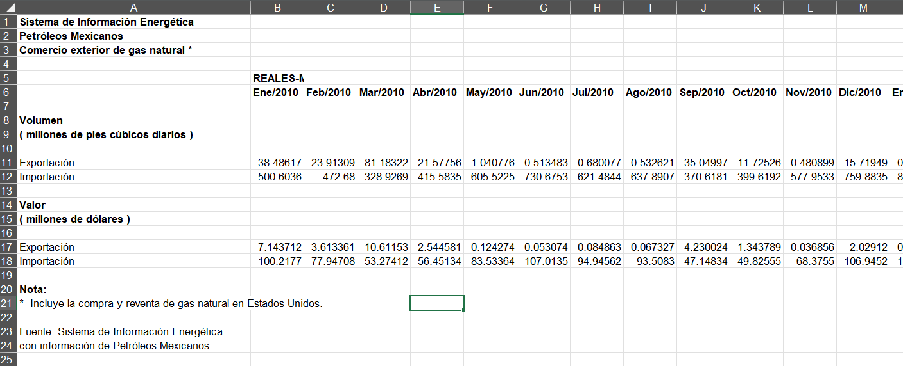
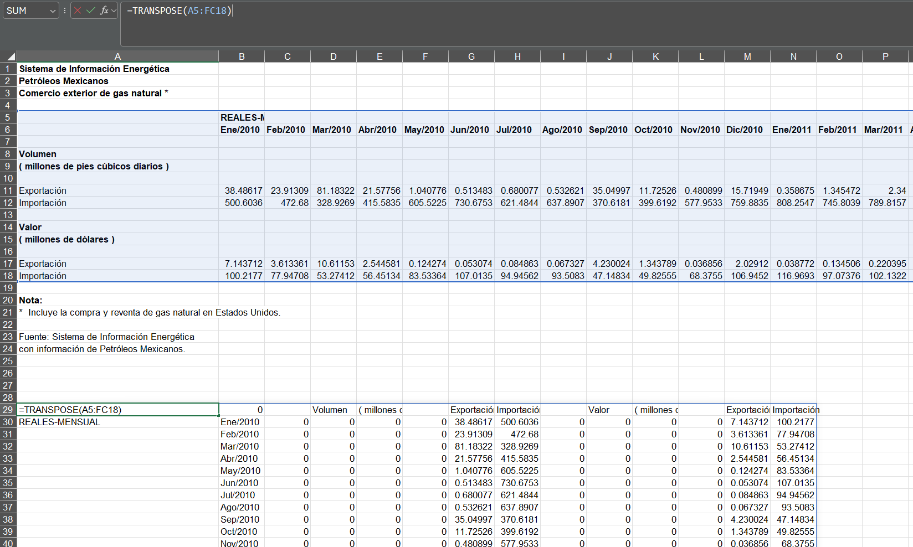
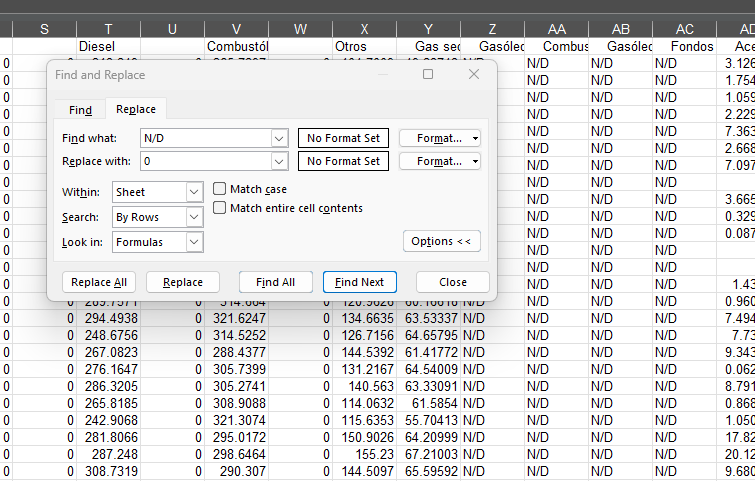
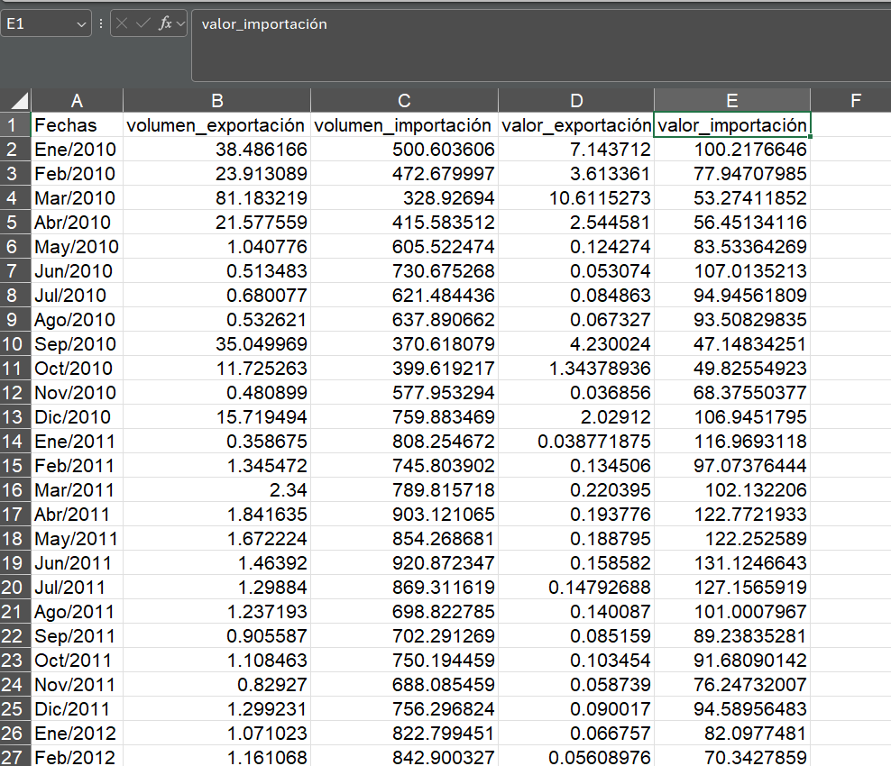

# Petróleos Mexicanos
Data analysis project exploring insights and trends in Mexico's petroleum industry


Image from [freepik](https://www.freepik.com/free-vector/offshore-oil-rig-raw-materials-fossil-extraction-equipment-heavy-machinery-smoking-chimneys-ocean-platform_25273103.htm#fromView=keyword&page=1&position=7&uuid=9c068652-659d-4c80-8b6e-91e9d7a183e2&query=Oil+Rig+Cartoon)

## Table Of Contents
- [Executive Summary](#executive-summary)
  - [Primary Goal](#primary-goal)
  - [Solution](#solution)
  - [Key Findings](#key-findings)
  - [Recommendations](#recommendations)
- [Introduction](#introduction)
  - [Business Problem](#business-problem)
  - [Goals](#goals)
- [Methodology](#methodology)
  - [Data Source](#data-source)
  - [Tools](#tools)
  - [Data Cleaning and Transformation](#data-cleaning-and-transformation)
  - [Data Analysis](#data-analysis)
  - [Data Visualisation](#data-visualisation)
- [Insights](#insights)
- [Action Plan](#action-plan)	 
- [Report](#report)	


## Executive Summary
### Primary Goal

### Solution

### Key Findings

### Recommendations

## Introduction
### Business Problem

### Goals

## Methodology
### Data source
For this project, datasets were sourced from the [Plataforma Nacional de Datos Abiertos](https://www.datos.gob.mx/), Mexico’s National Open Data Platform. As of May 2025, the platform has been updated to include a [historic data archive](https://historico.datos.gob.mx/), allowing users to access a broader range of datasets from various Mexican government institutions.

To gather relevant information, I searched using the term "petróleo", which returned over 90 results, including datasets and official documents published by **PEMEX (Petróleos Mexicanos), SENER (Secretaría de Energía), INEGI (INstituto Nacional de Estadística y Geografía)**, and other government bodies.

From this collection, I selected 14 datasets relevant to Mexico’s petroleum, gas, and oil industry—aligned with the scope of this project. The original files can be accessed via this [Github repository](https://github.com/alejandralopezgalan/petroleos-mexicanos/tree/main/assets/datasets/raw) and this [Google Drive Folder](https://drive.google.com/drive/folders/1Ht727_UwEuUORxWzpP4smzny2tHzYurv?usp=sharing).

A brief description of each dataset is provided below. Most of the data is recorded on a monthly basis, covering the period from January 2010 to February 2023.

| File | Description | 
| :--- | :--- |
| `SENER_05_ComercioExteriorGasNaturalImportacionExportacion-PMXE1C12_data.csv` | External trade of natural gas, reported by volume (millions of cubic feet per day) and value (millions of US dollars).| 
| `SENER_05_ElaboracionProductosPetroliferos-PMXD1C01_data.csv` | Production of petroleum products by category, measured in thousands of barrels per day.| 
| `SENER_05_ElaboracionProductosPetroquimicosDerivadosMetano-PMXD2C01_data.csv` | Production of petrochemical products derived from methane, measured in thousands of tons per day.| 
| `SENER_05_ImportacionesGasLicuadoPropanoButanoPuntoInternacion-PMXE2C12_data` | Import volumes of liquefied gas, propane, and butane by point of entry, measured in thousands of barrels per day.| 
| `SENER_05_PerforacionPozosPorRegion-PMXAC02_data.csv` | Number of oil wells drilled, broken down by region.| 
| `SENER_05_ProduccionPetroleoCrudoPorActivosRegion-PMXB1C05_data.csv` | Crude oil production by operational region, measured in thousands of barrels per day.| 
| `SENER_05_ProduccionPetroleoCrudoPorEntidadFederativa-PMXB1C02_data.csv` |  Crude oil production by state, measured in thousands of barrels per day.| 
| `SENER_05_ValorComercioIntTipoDeHidrocarburosSusDerivados-PMXF4C02_data.csv` | Monetary value of imports and exports of hydrocarbons and their derivatives, reported in millions of US dollars.| 
| `SENER_05_ValorExportacionesPetroleoCrudoPorDestinoGeografico-PMXF1C02_data.csv` | Export value of crude oil by geographic destination, measured in millions of US dollars.| 
| `SENER_05_VolumenImportacionPorTipoPetroliferos-PMXE2C15_data.csv` | Import volume of specific petroleum products, measured in thousands of barrels per day.| 
| `SENER_05_VolumenVentasPorTipoPetroliferos-PMXE2C01_data.csv` | Sales volume of petroleum products by type, measured in thousands of barrels per day.| 
| `Historico_Precios_Expendios_2023.csv` | Daily retail prices of petroleum products by authorised sellers for the year 2023. | 
| `Historico_Precios_Expendios_2024.csv` | Daily retail prices of petroleum products by authorised sellers for the year 2024. | 
| `Historico_Precios_Expendios_2025.csv` | Daily retail prices of petroleum products by authorised sellers for the year 2025.| 


### Tools
- Excel: Used for initial data exploration, cleaning, and formatting.
- Microsoft SQL Server: Used for querying and analysing the data.
- Power BI: Used to build the interactive dashboard.


### Data Cleaning and Transformation
#### Initial Data Transformation in Excel
In the initial data exploration, I found that in all the datasets were in horizontal format as seen in the following image. Therefore, the first step was switching rows into columns and columns into rows using the TRANSPOSE function in Excel.





The resulting table had some columns with zeros o missing values; nonetheless, these were not originally missing data, rather the result of trasposing the table. In some cases the original table had a N/D in some observations, which mean that no records or no data was available. Using Excel, all N/D observations were replaced with zeros. 



Finally, the table was copied into a new sheet, to remove unncesseary columns, rename useful columns, and get the correct information from the original dataset. 



The data was imported into a new Excel woorkbook and exported as a CSV file to be used in SQL.


there was a Date column with values like ene-05, Feb-05, Mar-05, abr-05. When converting them to a Date format in Excel, some cells were recognised correctly, but others were not. After reviewing the data, I realised that these values were monthly dates. To ensure consistency and prevent errors, I turned to the EDATE function in Excel.

Here’s how it works:
`EDATE(start_date, months)` shifts a date forward or backwards by a specified number of months. Since I needed all dates to follow a consistent format, such as 01/01/2010, 01/02/2010, 01/03/2010, I applied the formula:
`=EDATE(A2, 1)`

This helped standardise the datasets while adding one month to each value. I applied this transformation to the following datasets: `SENER_05_ComercioExteriorGasNaturalImportacionExportacion-PMXE1C12_data.csv`, `SENER_05_ElaboracionProductosPetroliferos-PMXD1C01_data.csv`, `SENER_05_ElaboracionProductosPetroquimicosDerivadosMetano-PMXD2C01.csv`, `SENER_05_ImportacionesGasLicuadoPropanoButanoPuntoInternacion-PMXE2C12`, `SENER_05_PerforacionPozosPorRegion-PMXAC02.csv`, `SENER_05_ProduccionPetroleoCrudoPorActivosRegion-PMXB1C05.csv`, `SENER_05_ProduccionPetroleoCrudoPorEntidadFederativa-PMXB1C02`, `SENER_05_ValorComercioIntTipoDeHidrocarburosSusDerivados-PMXF4C02.csv`, `SENER_05_ValorExportacionesPetroleoCrudoPorDestinoGeografico-PMXF1C02.csv`, `SENER_05_VolumenImportacionPorTipoPetroliferos-PMXE2C15.csv`, `SENER_05_VolumenVentasPorTipoPetroliferos-PMXE2C01.csv`. 

#### SQL
In Microsoft SQL Server Management Studio I created the database `pemex_db`, then I imported the file `ComercioExteriorGasNatural.csv` into the database. The first data transformation was to standarise the Dates. This file contained Dates in format "Ene/2010, Feb/2010, Mar/2010", etc. Therefore in SQL we used a conditional expression to create a new variable and transform the date to a 'dd-MM-yyyy' format.

**SQL code** 
```sql  
-- Create the pemex_db database to be used
CREATE DATABASE pemex_db;
USE pemex_db;

/*---------------------------
ComercioExteriorGasNatural
------------------------------
*/
-- Select the first 20 rows for initial observation
SELECT TOP 20 *
FROM ComercioExteriorGasNatural;

-- Add a new variable (FechaCompleta) to modify the date column
ALTER TABLE ComercioExteriorGasNatural
ADD FechaCompleta DATE;

/*The following query converts the dates from 'Fechas'
from Ene/2010, Feb/2010, and so on to
2010-01-01, 2010-02-2010, and so on
*/
UPDATE ComercioExteriorGasNatural
SET FechaCompleta = FORMAT(
	CAST('01-' +
		CASE
			WHEN LEFT(Fechas, 3) = 'Ene' THEN '01'
			WHEN LEFT(Fechas, 3) = 'Feb' THEN '02'
			WHEN LEFT(Fechas, 3) = 'Mar' THEN '03'
			WHEN LEFT(Fechas, 3) = 'Abr' THEN '04'
			WHEN LEFT(Fechas, 3) = 'May' THEN '05'
			WHEN LEFT(Fechas, 3) = 'Jun' THEN '06'
			WHEN LEFT(Fechas, 3) = 'Jul' THEN '07'
			WHEN LEFT(Fechas, 3) = 'Ago' THEN '08'
			WHEN LEFT(Fechas, 3) = 'Sep' THEN '09'
			WHEN LEFT(Fechas, 3) = 'Oct' THEN '10'
			WHEN LEFT(Fechas, 3) = 'Nov' THEN '11'
			WHEN LEFT(Fechas, 3) = 'Dic' THEN '12'
		END 
		+ '-' + 
		RIGHT(Fechas, 4)
	AS DATE), 
	'dd-MM-yyyy'
);

--Checking if the format is correct
SELECT TOP 24 *, 
DATEPART(DAY, FechaCompleta) AS DAY,
DATEPART(MONTH, FechaCompleta) AS MONTH,
DATEPART(YEAR, FechaCompleta) AS YEAR
FROM ComercioExteriorGasNatural;
```  


### Data Analysis

After standarising the dates, a new variable `Año` was created to get the Year of each date Then the net exports (`volumen_neto_exportaciones`) and the trade balance (`balanza_comercial`) of natural gas were calculated. In case `balanza_comercial` or `volumen_neto_exportaciones` were positive, SQL will print `Superávit` (surplus), otherwise `Déficit` (Deficit). `Superávit` refers to a trade surplus, which occurs when a the natural gas exports exceed its imports, whereas `Déficit` means that Mexico's natural gas imports exceed its exports, resulting in a negative trade balance.

| Measure | Description |
| :--- |:--- | 
| volumen_neto_exportaciones | Net exportations. Volume exportations minus volume importations of natural gas in millions of cubic feet per day. |  
| balanza_comercial | Trade balance. Value exportations minus value importations of natural gas in millions of US dollars.|  

**SQL code** 
```sql 
--Calculating the net exports (volume and value) by month and year
SELECT
	ROUND(volumen_exportación - volumen_importación, 2) AS volumen_neto_exportación,
	ROUND(valor_exportación - valor_importación, 2) AS valor_neto_importación,
	FechaCompleta
FROM ComercioExteriorGasNatural;

/*Calculating the volume net exports by year.
If positive then Superávit, if negative then Déficit
Otherwise equilibrio
*/ 
SELECT 
	Año,
	ROUND(SUM(volumen_exportación) - SUM(volumen_importación), 2) AS volumen_neto_exportaciones,
	ROUND(SUM(valor_exportación) - SUM(valor_importación), 2) AS balanza_comercial,
	CASE 
		WHEN SUM(volumen_exportación) - SUM(volumen_importación) > 0 THEN 'Superávit'
		WHEN SUM(volumen_exportación) - SUM(volumen_importación) < 0 THEN 'Déficit'
		ELSE 'Equilibrio'
	END AS volumen_comercial,
	CASE 
		WHEN SUM(valor_exportación) - SUM(valor_importación) > 0 THEN 'Superávit'
		WHEN SUM(valor_exportación) - SUM(valor_importación) < 0 THEN 'Déficit'
		ELSE 'Equilibrio'
	END AS valor_comercial
FROM ComercioExteriorGasNatural
GROUP BY Año;
 ```

After that the net exports of natural gas weere calculated in terms of value and volume using the following SQL code.


### Data Visualisation


## Insights
From 2010 to 2023 Mexico had a commercial natural gas deficit, from -559.57 to -23,180.58 for volume of natural gas in millions of cubic feet per day; meanwhile, for value of natural gas in millions of US dollars the déficit range from -72.81 to 2,814.44

## Action plan


## Report
To review the analysis in detail, you can download the Report here.

